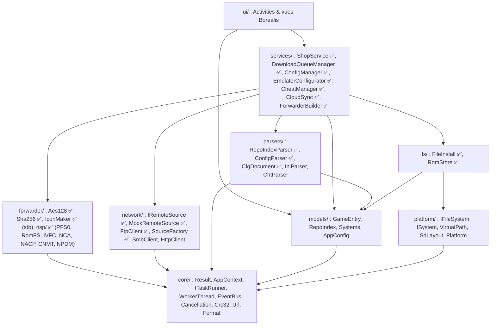
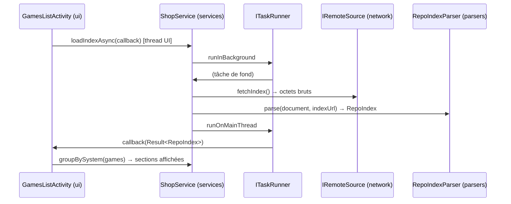
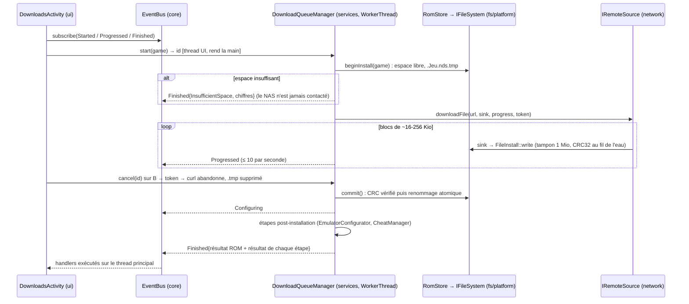
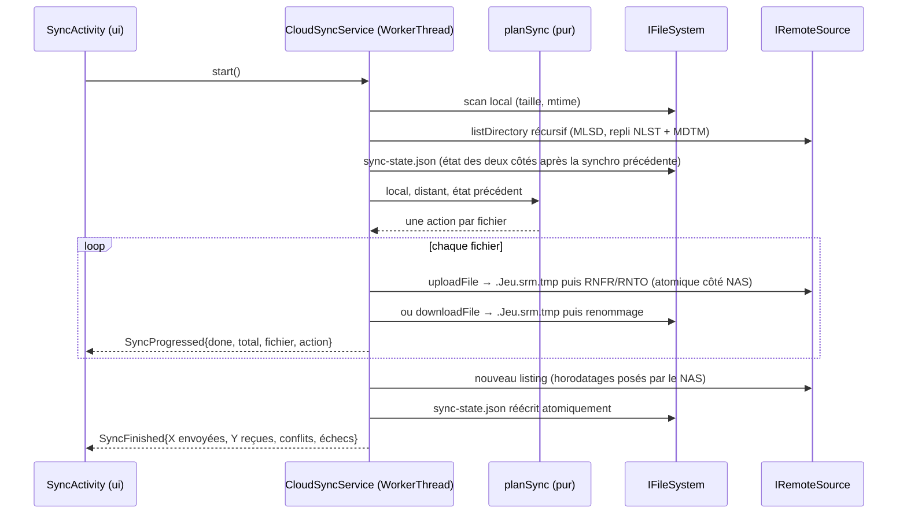
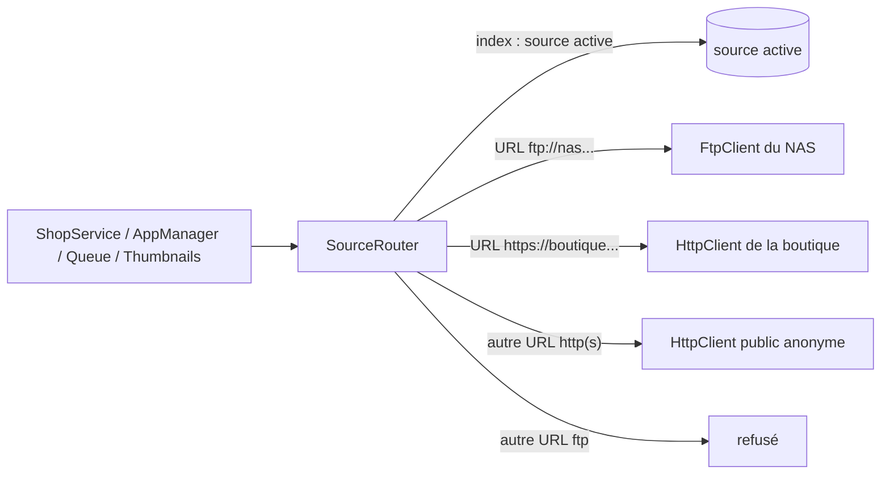
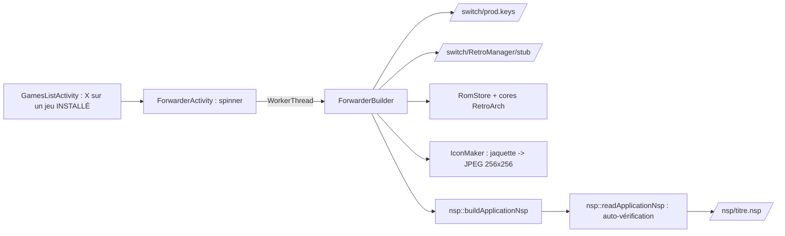

# Architecture de RetroManager

RetroManager est un homebrew Nintendo Switch (C++17, libnx, Borealis) qui gère
l'émulation rétro : sources réseau (FTP/SMB/JSON), ROMs, configuration de
RetroArch, cheats, sauvegardes cloud et forwarders.

Ce document fixe **comment le code est découpé et comment les modules
communiquent**. Toute contribution doit le respecter ; en cas de besoin qui le
contredit, on modifie d'abord ce document.

---

## 1. Principes

1. **Dépendances à sens unique.** Une couche ne connaît que les couches situées
   en dessous d'elle. Aucune dépendance ne remonte, aucun cycle n'existe.
2. **La plateforme est une abstraction.** Aucun module n'appelle directement
   `<filesystem>`, `fopen`, libnx ou libcurl : il passe par une interface
   (`IFileSystem`, puis `IRemoteSource`, `ISystem`…).
3. **Injection explicite.** Chaque classe reçoit ses dépendances par son
   constructeur. Aucun singleton ni état global dans le code métier.
4. **Tout le code métier tourne sur PC.** C'est ce qui rend le TDD possible :
   la cible `retromanager_core` ne dépend ni de Borealis ni de libnx.
5. **Pas d'exceptions dans le core.** Les erreurs remontent par `Result<T>` et
   `Status` (`include/retromanager/core/Result.hpp`).

---

## 2. Couches



| Couche | Rôle | Peut dépendre de | Ne doit **jamais** |
|---|---|---|---|
| `core/` | Types de base (`Result`, `Status`), composition (`AppContext`), exécution (`ITaskRunner`, `WorkerThread`, `CancellationToken`), `EventBus`, utilitaires purs (`Url`, `Format`, `Crc32`) | STL | inclure Borealis ou libnx |
| `models/` | Données pures partagées par toutes les couches (`GameEntry`, `RepoIndex`, `SystemSection`, `AppConfig`) et catalogue des systèmes | `core` | contenir du comportement autre que des accesseurs |
| `platform/` | Abstractions système (`IFileSystem`, `ISystem` : anti-veille) + implémentations par plateforme | `core` | contenir de la logique métier |
| `parsers/` | Fonctions **pures** texte ⇄ structures : index JSON, `config.json`, `CfgDocument` (`.cfg` / `.cht` RetroArch, édition sans perte) | `core`, nlohmann/json | faire des E/S : ils reçoivent et rendent des chaînes |
| `fs/` | Opérations SD typées : `FileInstall` (écriture en flux vers un fichier caché, tampon 1 Mio, CRC-32, contrôle d'en-tête, espace libre, publication atomique) et `RomStore` (destination `/roms/<système>/`) | `platform`, `models`, `core` | parler au réseau |
| `network/` | Déplace des octets derrière `IRemoteSource` (index en mémoire, ROMs en flux vers un `ChunkSink`) | `core` (+ libcurl pour `FtpClient`) | parser un index, écrire sur la SD |
| `forwarder/` | Crypto (AES-128 ECB/CTR/XTS, SHA-256), icône (stb), et `nsp/` : écriture et relecture des formats Switch d'un forwarder, isolées du reste | `core` (+ stb, en-têtes seuls) | toucher la SD, le réseau ou Borealis : octets en entrée, octets en sortie |
| `services/` | Cas d'usage : orchestrent parsers, fs et network | tout ce qui précède | inclure Borealis |
| `ui/` | Affichage et navigation Borealis | `services`, `models`, `core` | appeler un parser, un `IRemoteSource` ou `IFileSystem` directement |

> Exception assumée : `HomeActivity` lit encore `AppContext` directement (plateforme,
> détection de RetroArch). Elle passera par un service système quand celui-ci
> existera (Phase configurateur).

### Cibles CMake

| Cible | Contenu | Plateformes |
|---|---|---|
| `retromanager_core` | `src/core`, `src/models`, `src/parsers`, `src/fs`, `src/forwarder`, `src/services`, `src/platform/common`, `MockRemoteSource` | toutes : c'est ce qu'on teste |
| `retromanager_curl` | `FtpClient`, `SourceFactory` (libcurl). Option `RM_WITH_CURL`, activée par défaut | toutes |
| `RetroManager` | `src/main.cpp`, `src/ui`, **une seule** implémentation de `src/platform/{switch,desktop}` + Borealis | desktop, Switch (`.nro`) |
| `retromanager_mocks` | `tests/mocks` : `MemoryFileSystem`, chargeur de fausse SD | desktop (tests) |
| `retromanager_tests` | `tests/unit`, `tests/integration` (GoogleTest) | desktop |

La séparation physique des cibles fait respecter la règle : le core n'a pas
Borealis dans ses chemins d'inclusion, donc une violation ne compile pas.

---

## 3. Abstraction du système de fichiers

### 3.1 Chemins virtuels

L'application ne manipule qu'un seul format de chemin : **POSIX, absolu,
enraciné à la carte SD** (`/retroarch/retroarch.cfg`). `vpath::normalize()`
résout `.`, `..`, `//` et `\`, et **refuse** tout chemin relatif ou qui sort de
la racine (`/../x`). Seule l'implémentation d'`IFileSystem` sait convertir un
chemin virtuel en chemin réel.

`SdLayout` centralise les emplacements connus (RetroArch, sys-clk, dossier de
l'app). Ce sont des **valeurs par défaut** : dès la Phase 2, les services
liront les vrais chemins dans `retroarch.cfg`.

### 3.2 Contrat `IFileSystem`

- `stat`, `listDirectory` (trié par nom), `createDirectories` (idempotent),
  `openRead` / `openWrite` (par flux, pour les gros fichiers), `remove`,
  `removeAll`, `rename`, et des utilitaires communs (`readFile`, `writeFile`,
  `exists`…).
- **Écritures atomiques** : `openWrite("/roms/nds/Jeu.nds")` écrit dans un
  fichier de transit caché, `/roms/nds/.Jeu.nds.tmp` (masqué dans les
  listings), renommé sur la cible seulement au `close()`. Détruire le flux
  sans `close()` supprime le `.tmp`. Un crash, une annulation ou une coupure
  réseau ne laisse jamais de ROM tronquée ni de save corrompue.
- **Écritures reprenables** (Phase 8) : `suspend()` ferme le flux en gardant
  le `.tmp` (toujours caché, jamais publié) ; `openWrite(path, {resume})`
  le rouvre en ajout et `resumedFrom()` donne sa taille. Un `openWrite`
  normal repart de zéro. Couvert par la suite de contrat (mémoire et disque).
- `availableSpace(path)` : espace libre du volume (`Unsupported` si la
  plateforme ne sait pas le dire ; l'appelant continue alors sans contrôle).
- Codes d'erreur normalisés (`NotFound`, `NotADirectory`, `IsADirectory`,
  `NotEmpty`, `InvalidPath`, `PermissionDenied`…), identiques sur toutes les
  implémentations.

### 3.3 Implémentations

| Implémentation | Racine | Usage |
|---|---|---|
| `LocalFileSystem("sdmc:/")` | carte SD montée par libnx | console |
| `LocalFileSystem(<dossier>)` | `retromanager/sdmc/` ou `$RETROMANAGER_SD_ROOT` | app desktop sur une fausse SD |
| `test::MemoryFileSystem` | RAM | tests unitaires rapides et hermétiques ; lecture seule et capacité de carte simulables |

**Test de contrat** (`tests/unit/FileSystemContractTest.cpp`) : la même suite
s'exécute contre chaque implémentation. C'est la garantie qu'un service validé
sur le mock en mémoire se comporte pareil sur la vraie SD.

### 3.4 Fausse carte SD

`tests/fixtures/sd_card/` est la **seule source de vérité** de la fausse SD :

- les tests la chargent en mémoire (`test::makeMockSdCard()`, une copie
  indépendante par appel) ;
- `tools/make_mock_sd.py` la copie dans `retromanager/sdmc/` pour lancer l'app
  desktop sans jamais modifier la fixture.

---

## 4. Communication entre modules

### 4.1 Composition

`main.cpp` est la **racine de composition**, le seul endroit qui sait sur
quelle plateforme on tourne :

```
createPlatformServices()  →  AppContext(fs, layout, …)  →  services(ctx…)  →  Activities(services…)
```

Les services reçoivent des références aux interfaces dont ils ont besoin. Un
test construit exactement le même graphe autour d'un `MemoryFileSystem` et
d'un faux `IRemoteSource`.

### 4.2 Flux implémenté (Phase 2) : afficher la boutique



L'UI ne connaît que `ShopService` et les modèles. `main.cpp` choisit la
source d'après `config.json` (`ConfigManager` → `createRemoteSource` :
`FtpClient`, `MockRemoteSource`, ou `UnavailableRemoteSource` qui porte
l'erreur de configuration jusqu'à l'écran) : changer de source ne touche ni
l'UI ni les services. Configuration : [docs/CONFIG.md](docs/CONFIG.md).

Format de l'index : [docs/INDEX_FORMAT.md](docs/INDEX_FORMAT.md).

### 4.3 Flux implémenté (Phase 3) : télécharger une ROM



Pendant tout le travail (transfert et étapes), un `AwakeLock` tient la
console éveillée (`ISystem::setKeepAwake` : `appletSetMediaPlaybackState`
sur Switch, rien sur desktop). Il est relâché sur tous les chemins de sortie
(succès, erreur, annulation, refus faute d'espace).

**Étapes post-installation** (`services/PostInstallStep.hpp`) :
`DownloadQueueManager` exécute, dans l'ordre, les `IPostInstallStep` enregistrés
dans `main.cpp`, une fois la ROM validée sur la carte. Une étape en échec ne
défait jamais l'installation : son erreur est rapportée à côté.

| Étape | Effet |
|---|---|
| `EmulatorConfigurator` | `rgui_browser_directory` de `retroarch.cfg` pointe sur le dossier de la ROM (`/roms/nds/`). Édition via `CfgDocument` : seule la valeur change, tout le reste du fichier est conservé octet pour octet. Copie `retroarch.cfg.rmbak` avant la première modification ; fichier créé s'il n'existe pas ; rien si RetroArch n'est pas installé. |
| `PlaylistManager` | Ajoute le jeu à `<playlist_directory>/<système libretro>.lpl` (JSON RetroArch ; l'ancien format à 6 lignes est lu puis converti) : chemin, libellé = nom de la ROM sans extension, cœur `DETECT`, CRC-32 **mesuré pendant le téléchargement** (`DownloadQueueManager` le transmet aux étapes). `PlaylistDocument` conserve tout ce que RetroArch a écrit (champs inconnus, ordre des clés, autres entrées) ; une entrée existante pour le même fichier est mise à jour, jamais dupliquée ; copie `.lpl.rmbak` ; playlist illisible = laissée intacte (`ParseError`). |
| `ThumbnailManager` | Si l'entrée a une jaquette (`boxart` / `url_boxart`) : PNG vérifié (signature), 8 Mio max, écrit dans `<thumbnails_directory>/<système libretro>/Named_Boxarts/<libellé>.png` avec la règle de nommage de RetroArch (`&` `*` `/` `:` `<` `>` `?` `\` `\|` et l'accent grave deviennent `_`). |
| `CheatManager` | Si l'entrée a un `cheat_url` : télécharge le `.cht` (1 Mio max, validé comme fichier de triche RetroArch) dans `<cheat_database_path>/<système libretro>/<nom de la ROM>.cht`. |
| `SysClkConfigurator` | Pour un jeu N64 ou PlayStation (pas la 3DS, qui tourne dans Citra autonome) : section `[<title id>]` de `/config/sys-clk/config.ini` avec `handheld_cpu=1785` et `docked_cpu=1785`. Édition via `IniDocument` (sections, commentaires `;`/`#`, sans perte), copie `config.ini.rmbak`, idempotent ; `NotFound` si sys-clk n'est pas installé (`/config/sys-clk` absent). Title id configurable (`sysclk.title_id`, défaut `010000000000100D`, l'applet Album dans lequel tourne un `.nro` lancé depuis hbmenu), étape désactivable (`sysclk.enabled`). |

La mémoire consommée ne dépend pas de la taille de la ROM : tampon
d'écriture de 1 Mio + tampon de réception curl de 256 Kio. Le test
d'intégration mesure la mémoire résidente pendant un téléchargement de
64 Mio : environ +1,2 Mio (échec au-delà de 16 Mio).

**Téléchargements génériques** (Phase 7) : `DownloadQueueManager` exécute des
`DownloadJob` (titre, URL, destination, et trois fonctions : `begin` crée le
`FileInstall`, `afterInstall` fait le travail qui suit avec le CRC mesuré,
`onFailed` range ce que le job a créé). `start(GameEntry)` construit le job
d'une ROM (RomStore + étapes post-installation), `AppManager::job()` celui
d'un homebrew : même flux, même annulation, mêmes événements, même écran.

### 4.4 Flux implémenté (Phase 5) : synchroniser les sauvegardes

`CloudSyncService` (services, son propre `WorkerThread`) synchronise dans
les deux sens les sauvegardes RetroArch (`.srm`, `.sav`, `.dsv`, sous-dossiers
jusqu'à 3 niveaux) entre `savefile_directory` (lu dans `retroarch.cfg`,
`/retroarch/saves` par défaut) et le dossier `saves_url` du NAS.



**Décision** (`services/SyncPlanner.cpp`, fonction pure, 11 tests) : la règle
« le plus récent gagne » seule provoque un ping-pong (après un envoi, la
copie du NAS porte l'heure de l'envoi, plus récente que le fichier local) et
dépend de l'horloge des deux machines. RetroManager compare donc chaque côté
à **son propre état lors de la dernière synchro** (manifeste
`/switch/RetroManager/sync-state.json`) :

| Local | NAS | Action |
|---|---|---|
| modifié | inchangé | envoi |
| inchangé | modifié | réception |
| absent / présent seul | | copie vers l'autre côté (**les suppressions ne sont pas propagées**) |
| modifié | modifié | conflit : le plus récent reste en place, l'autre est **conservé** en `<fichier>.conflict-{local\|remote}-AAAAMMJJ-HHMMSS` (égalité : la console gagne) |
| première synchro, identiques à 2 s près (FAT) | | à jour |

**Robustesse** : un fichier en échec est rapporté et garde son ancien état
(il sera retenté) ; les autres continuent. Annulation entre deux fichiers :
les fichiers déjà échangés le restent, l'état des autres est conservé. Un
manifeste corrompu ou écrit pour un autre NAS est ignoré (tout devient
« première synchro » : aucune perte, au pire des copies de conflit). La
console reste éveillée pendant toute la synchro (`AwakeLock`).

Tests : `CloudSyncTest` (17, mocks FS + NAS avec horloges contrôlées),
`FtpSaveIntegrationTest` (8 : MLSD, remplacement atomique, envoi par blocs,
annulation, dossier absent, repli NLST, identifiants), `CloudSyncOverFtp` :
**deux consoles** (deux cartes SD) contre le même serveur FTP : échanges
croisés sans ping-pong, puis jeu simultané des deux côtés → les deux versions
sont gardées.

### 4.5 Flux implémenté (Phase 6) : BIOS

`BiosManager` (services, son propre `WorkerThread`) croise trois sources :
le catalogue (`models/Bios.cpp` : fichier, système, MD5 de référence,
requis ou non), le dossier système de RetroArch (`system_directory`,
`/retroarch/system` par défaut ; recherche insensible à la casse comme FAT)
et la section `bios` de l'index de la boutique.

- `check(offres)` : une ligne par fichier du catalogue, plus les fichiers
  proposés hors catalogue, triées par système. État : manquant, présent et
  vérifié (MD5), présent mais « version non reconnue », présent sans
  référence (`firmware.bin`, propre à chaque console).
- `installNow(offre)` : téléchargement en flux vers un fichier caché
  (`openWrite`), MD5 calculé au fil de l'eau ; si la boutique annonce un MD5
  différent, rien n'est installé (`IntegrityError`). Sans MD5 de la
  boutique, le fichier est installé et `check()` dit s'il est reconnu : le
  catalogue n'est qu'une référence (autres régions, révisions).
- `startInstall(offres)` : en arrière-plan, `BiosInstalled` par fichier (un
  échec n'arrête pas les autres) puis `BiosInstallFinished`.

`BiosActivity` : chargement de l'index (asynchrone), puis la liste par
système, A sur une ligne pour télécharger, X pour tout télécharger. Si le
serveur est injoignable, l'état de la carte SD s'affiche quand même.

### 4.6 Flux implémenté (Phase 7) : App Store personnel

Sections `apps` et `emulators` de l'index → `AppEntry` (titre, auteur,
version, description, `url_nro`, `url_icon`, dossier). `AppManager` :

- **Emplacement** : `/switch/<dossier>/<dossier>.nro` (disposition standard
  de hbmenu), le dossier étant le titre (ou le champ `folder`) rendu sûr
  pour FAT ; un nom dangereux (`..`, `/`, fichier caché) est refusé dès
  l'index.
- **Téléchargement** : le job passe par le même `FileInstall` que les ROMs
  (flux, `.tmp`, espace, CRC facultatif) avec en plus un **contrôle d'en-tête
  NRO** (`NRO0` à l'octet 0x10) dès les premiers octets : une page d'erreur
  ou un fichier tronqué ne remplace jamais un homebrew qui marche. Taille
  absente de l'index : demandée au serveur (listing) pour que le contrôle
  d'espace ait lieu. Échec d'une première installation : le dossier vide
  est supprimé (pas de dossier fantôme dans hbmenu).
- **Après** : l'icône (`/switch/<dossier>/<dossier>.jpg`, le nom que hbmenu
  cherche pour un `.nro` sans icône intégrée, et une copie `icon.jpg` ; JPEG
  vérifié, 2 Mio max ; un échec n'annule pas l'installation), puis la version installée est
  notée dans `/switch/RetroManager/apps.json`.
- **État** : non installé, installé (`.nro` présent ; version inconnue si
  installé à la main), mise à jour disponible (version notée ≠ version de
  l'index).

`AppsListActivity` : deux sections (Émulateurs, Homebrews), version et
auteur sous le titre, tag « INSTALLÉ » / « MISE À JOUR » rafraîchi après
chaque téléchargement ; le bilan affiche « Application installée dans
/switch/... ».

### 4.7 Flux implémenté (Phase 8) : file d'attente et reprise

`DownloadQueueManager` (ex-`DownloadService`) est la file unique de l'app :
un clic sur un jeu ou une application **ajoute** un `DownloadJob` et rend la
main immédiatement ; l'UI n'attend jamais.

```mermaid
sequenceDiagram
    participant UI as Listes / DownloadsActivity (thread UI)
    participant Q as DownloadQueueManager
    participant W as WorkerThread (drain)
    UI->>Q: start(job) : ajouté en fin de file (doublon ignoré)
    Q-->>UI: DownloadQueueChanged{snapshot}
    Q->>W: drain() posté si aucun n'est en cours
    loop tant que la file n'est pas vide (anti-veille tenu tout du long)
        W->>W: dépile, état Running, DownloadQueueChanged
        W->>W: run(job) : Started, Progressed (10/s), Configuring, Finished
    end
    UI->>Q: cancel(id) : en attente = retiré ; en cours = token annulé
```

- **Un seul transfert à la fois**, dans l'ordre d'ajout. Un élément ajouté
  pendant qu'un autre tourne (même depuis un handler d'événement) rejoint
  la même boucle.
- **Anti-veille** : pris au premier élément, rendu quand la file est vide
  (pas de fenêtre de mise en veille entre deux éléments).
- **État lisible de partout** : `snapshot()` (en cours puis en attente, avec
  progression), `history()` (30 derniers résultats, avec les étapes),
  `isQueued(itemId)` pour les tags « EN FILE ». Tout est protégé par un
  mutex ; les événements sont livrés sur le thread principal par l'EventBus.
- **Reprise** : `begin()` rouvre le `.tmp` d'une tentative interrompue ;
  `FileInstall` relit une fois ses octets pour que le CRC-32 porte sur le
  fichier entier (et revérifie l'en-tête NRO) ; puis
  `IRemoteSource::downloadFileFrom(offset)` : `REST <offset>` avant `RETR`
  côté FTP (`CURLOPT_RESUME_FROM_LARGE`). Serveur qui refuse (ou offset
  au-delà de la fin) : `Unsupported`, le `.tmp` est vidé et le fichier
  retéléchargé depuis le début. Un `.tmp` déjà complet est simplement
  vérifié.
- **Que garde-t-on ?** Coupure réseau ou fermeture de l'app : le `.tmp` est
  gardé (`suspend()`) pour la reprise. Annulation par l'utilisateur, CRC ou
  en-tête faux, carte pleine : il est supprimé. Si le fichier du NAS a
  changé entre-temps, le CRC (quand l'index le donne) détecte le mélange et
  le fichier est retéléchargé proprement à la tentative suivante.

UI : `DownloadsActivity` (en cours avec barre, pourcentage, débit et
« reprise à … » ; en attente, A retire ; terminés, A affiche le bilan ;
X annule l'élément en cours). Les listes ne sont reconstruites que quand
leur contenu change, avec le focus replacé sur la même ligne ; la
progression ne met à jour que des libellés. `DownloadNotifier` affiche
« Installé : … » / « Échec : … » quel que soit l'écran. Accueil : bouton
« Téléchargements (N) » ; boutique et App Store : Y ; App Store : bouton
« Mettre à jour N applications ».

### 4.8 Flux implémenté (Phase 9) : web, sources multiples, scraper, file persistante



- **`HttpClient`** (`network/`, libcurl) : `IRemoteSource` HTTP(S). Index en
  mémoire (plafonné), fichiers en flux, reprise `Range: bytes=N-` (206
  attendu ; 200 ou 416 = `Unsupported`, détecté au premier octet, avant tout
  écriture), statut vérifié avant le corps (404/401/403…), redirections
  suivies (http/https seulement), identifiants Basic uniquement vers
  l'hôte de la source et jamais transmis à une redirection. Pas de listing ni
  d'envoi (`Unsupported`). `curl::ensureInitialized()` est partagé avec
  `FtpClient` (un seul `curl_global_init` par processus).
- **`SourceRouter`** : toutes les sources derrière un seul `IRemoteSource`.
  Côté boutique (index, description), la source *active*, changeable à
  chaud ; côté URL, la source *propriétaire* (même serveur que son index) :
  un téléchargement en file garde son serveur et ses identifiants même si
  l'utilisateur change de boutique. Les autres URL web passent par le client
  public anonyme (jaquettes libretro) ; les autres serveurs FTP sont refusés.
  Une source supprimée reste vivante tant qu'un transfert l'utilise
  (`shared_ptr`).
- **`SourceCatalog`** : ajout / suppression / activation d'une source, validé
  comme le ferait le client, appliqué au routeur **et** enregistré dans
  `config.json` (jamais si le fichier était illisible ; la version remplacée
  reste dans `config.json.bak`). Écran `SourcesActivity` (liste sur deux
  lignes, avertissements de `config.json`) et formulaire `SourceFormActivity`
  (champs libellés `FormField` : valeur affichée en entier, clavier de la
  console prérempli, erreurs dans le formulaire ; ajout ou modification en
  place via `SourceCatalog::update`). Focus : seuls des boutons et des
  `FormField` (boîtes `ROW`) sont focusables ; Borealis demande la suite à la
  vue focalisée elle-même, et une boîte `COLUMN` focusable parcourait d'abord
  ses propres enfants.
- **Erreurs réseau** : `curl::fromCode` → `cURL error <code> (<nom>): <détail
  du serveur>` ; les URL passent par `url::encodeForTransfer` (espaces,
  non-ASCII) avant libcurl. Journal : `/switch/RetroManager/logs/retromanager.log`.
- **`config.json` écrit à la main** : `parseConfig` accepte BOM, commentaires,
  virgules finales, alias de clés, URL seule ; une source incohérente est
  ignorée (jamais complétée par défaut) et décrite dans `AppConfig::warnings`,
  les autres sont chargées.
- **Scraper** : `ThumbnailManager` essaie la jaquette de l'index, puis
  `<base>/<système libretro>/Named_Boxarts/<libellé>.png` (encodé), en
  silence en cas d'absence.
- **File persistante** : chaque `DownloadJob` porte une charge utile JSON
  (`EntryJson` : le `GameEntry` ou l'`AppEntry` complet). À chaque changement
  de la file, `DownloadQueueManager` appelle la fonction de persistance avec
  les éléments restants (en cours compris) ; `QueueStore` les écrit
  atomiquement dans `queue.json`. Pas d'écriture pendant la fermeture de
  l'app : le fichier garde ce qui restait. Au lancement, `restoreQueue()`
  remet tout en file (ROM directement, homebrew via `AppManager::job()`), et
  la reprise `.tmp` fait le reste. Un numéro de séquence empêche un état
  ancien d'écraser un plus récent quand l'UI et le worker enregistrent en
  même temps.

### 4.9 Flux implémenté (Phase 10) : raccourcis HOME (forwarders)



- **`ForwarderBuilder`** (`services/`) : vérifie les prérequis (clés, stub),
  retrouve la ROM (`RomStore`), choisit le premier core RetroArch installé
  parmi les candidats du système (`gba` : mgba, vba_next, gpsp…), fabrique
  l'icône, décrit l'application et écrit `/nsp/<titre>.nsp` atomiquement.
  Chaque échec est un `ForwarderIssue` précis (clés absentes, clé manquante,
  fichier du stub absent, NPDM invalide, ROM absente, core absent, écriture
  impossible) que l'UI traduit en message disant **quel fichier mettre où**.
  Le « packager » est injectable : les tests en mettent un qui enregistre la
  description (titre, icône, arguments) sans rien chiffrer.
- **Lancement** : le stub (fourni par l'utilisateur, type nx-hbloader
  forwarder) lance `romfs:/nextNroPath` avec `romfs:/nextArgv`. RetroManager
  y écrit `sdmc:/retroarch/cores/<core>_libretro_libnx.nro` et
  `"<core>" "sdmc:/roms/<système>/<rom>"`.
- **Title ID** : `0x0100` + 32 bits d'un SHA-256 du chemin de la ROM +
  `0000` : forme d'une application standard (le menu HOME ignore les autres),
  stable (regénérer remplace le même titre).
- **`IconMaker`** (`forwarder/`) : stb_image (PNG, JPEG…), mise à l'échelle
  (stb_image_resize2) *sans recadrer* dans un carré 256x256, bandes remplies
  avec la couleur moyenne du bord, JPEG (stb_image_write) dont la qualité
  baisse jusqu'à tenir sous 128 Kio. Sans jaquette : icône unie par système.
  stb est compilé une seule fois, en fonctions `static`
  (`StbImage.cpp`), pour ne pas entrer en conflit avec la copie de nanovg.
- **`nsp/`** (la partie « hacbrewpack », isolée : octets en entrée, octets en
  sortie, aucune dépendance à la SD) :
  - conteneurs : PFS0, RomFS (tables de hachage comprises : la console y
    cherche `nextNroPath`), HierarchicalSha256 et IVFC (6 niveaux, blocs de
    0x4000) ;
  - NCA3 : en-tête chiffré AES-XTS (`header_key`, tweak big-endian à la
    Nintendo), sections AES-CTR avec une clé de contenu aléatoire rangée dans
    la key area (`key_area_key_application_00`, génération de clés 0 : toute
    version du firmware) ; pas de rights id, donc ni ticket ni certificat ;
  - métadonnées : NACP (titre pour les 16 langues), CNMT (application), NPDM
    du stub patché avec le title id (ACI0 + plage ACID) ;
  - NSP = PFS0 de `<id>.nca` (programme : ExeFS + RomFS [+ logo]),
    `<id>.nca` (contrôle : `control.nacp` + `icon_<Langue>.dat`) et
    `<id>.cnmt.nca`, l'id étant le début du SHA-256 de chaque NCA ;
  - lecteurs symétriques (`readNca`, `readApplicationNsp`) : ils vérifient
    tout (hachages, ids, tailles, title ids) et servent aux tests **et** à
    l'auto-vérification avant écriture.
- **Signatures** : impossibles à produire sans les clés privées de Nintendo
  (signature de l'en-tête NCA, signature NPDM/ACID) : les sigpatches sont
  nécessaires sur la console, l'écran de bilan le rappelle.
- **Secrets** : `prod.keys` est lu, jamais journalisé ni recopié ; les
  messages d'erreur nomment la clé, jamais sa valeur. Les tests n'utilisent
  que des clés factices.

### 4.10 Asynchronisme

- Les opérations longues passent par `ITaskRunner` (`core/ITaskRunner.hpp`) :
  - `ui::BorealisTaskRunner` (`brls::async` / `brls::sync`) pour les tâches
    courtes (chargement de l'index) ;
  - `WorkerThread`, un thread dédié possédé par `DownloadQueueManager` (et un
    autre par `CloudSyncService` et par `BiosManager`), pour les
    téléchargements et la synchro :
    ils durent des minutes et ne doivent pas bloquer la
    boucle de tâches unique de Borealis ;
  - `ImmediateTaskRunner` ou une file manuelle dans les tests, qui restent
    donc synchrones et déterministes.
- Les services livrent leurs résultats par callback **sur le thread
  principal**. Ils ignorent tout de Borealis : c'est l'implémentation
  d'`ITaskRunner` fournie par l'UI qui fait le saut de thread.
- Une activité fermée avant la fin d'un chargement ne doit pas être touchée
  par le callback : `GamesListActivity` garde un drapeau de vie
  (`shared_ptr<bool>`), vérifié sur le thread principal.
- `Application::exit()` de Borealis attend la fin du thread de tâches : les
  services créés dans `main()` survivent donc à toute tâche en cours.
- **EventBus** (`core/EventBus.hpp`) : canal typé services → UI pour les
  événements qui durent (progression des téléchargements et de la synchro
  cloud). `publish()` depuis n'importe quel thread ; les handlers tournent
  toujours sur le thread principal ; une `Subscription` détruite n'est plus
  jamais appelée, même pour un événement déjà en file.
- `DownloadQueueManager`, `CloudSyncService` et `BiosManager` possèdent leur `WorkerThread` :
  leur destructeur annule tout et attend la fin du transfert en cours. Dans
  `main()`, ils sont déclarés en dernier pour être détruits en premier.

### 4.11 Gestion des erreurs

`Result<T>` / `Status` à chaque frontière. Les services ajoutent du contexte au
message ; l'UI traduit `ErrorCode` en message localisé (i18n : réseau,
authentification, index introuvable, format invalide, espace insuffisant,
CRC incorrect, configuration absente). Aucune exception ne
traverse une frontière de couche (le parser attrape celles de nlohmann/json).

---

## 5. Stratégie de test (TDD)

1. **Test d'abord** pour toute fonction critique (parsers, écriture de
   `.cfg`, synchronisation, parsing des listings FTP).
2. **Unitaires** (`tests/unit`) : `MemoryFileSystem` et fakes, rapides.
3. **Contrat** : une suite par interface, exécutée sur chaque implémentation.
4. **Intégration** (`tests/integration`) : `FtpClient` → `DownloadQueueManager` →
   `RomStore` → disque, contre un vrai serveur local
   (`tools/test_ftp_server.py`, pyftpdlib) servant `tests/fixtures/ftp_root`
   plus une ROM générée de 64 Mio avec son CRC, un second serveur **FTPS**
   au certificat auto-signé, et la même arborescence en **HTTP** (Range,
   serveur sans Range, Basic auth, codes d'erreur, redirection, faux serveur
   de vignettes libretro). Couvert : flux, mémoire bornée, annulation,
   nettoyage du `.tmp`, fichier absent, identifiants jamais envoyés à un autre
   hôte, `verifyTls` on/off, reprise REST et Range. Ignorés (`SKIPPED`) sans
   `RM_TEST_FTP_PORT` / `RM_TEST_FTPS_PORT` / `RM_TEST_HTTP_PORT`.
   Forwarders : vecteurs officiels (FIPS-197, SP 800-38A, IEEE 1619,
   FIPS 180-4) pour la crypto, allers-retours écriture/lecture pour chaque
   format, et **contre-vérification indépendante** avec hactool
   (`RM_HACTOOL`, clés factices) : tous les hachages GOOD et les sections
   déchiffrées identiques octet pour octet.
5. **CI** (`.github/workflows/retromanager.yml`) : tests sous ASan et UBSan
   avec les serveurs et hactool, build desktop, libcurl compilée depuis les
   sources, build Switch `.nro` dans le conteneur `devkitpro/devkita64`.

---

## 6. Organisation des fichiers

```
retromanager/
├── CMakeLists.txt, CMakePresets.json   # presets tests / desktop / switch
├── cmake/                              # FetchBorealis (avant project()), Dependencies, Curl
├── docs/                               # INDEX_FORMAT.md, CONFIG.md, captures
├── include/retromanager/<couche>/      # en-têtes publics, un dossier par couche
├── src/<couche>/                       # implémentations (même découpage)
│   └── platform/{common,switch,desktop}
├── resources/                          # XML Borealis, i18n (en-US, fr), images
├── tests/{mocks,unit,integration,fixtures/{sd_card,ftp_root}}
└── tools/{make_mock_sd.py,test_ftp_server.py}
```

Nommage : `IXxx` pour une interface, un fichier par classe, espace de noms
`rm` (`rm::ui`, `rm::test`, `rm::vpath`).

---

## 7. Feuille de route

| Phase | Contenu | Statut |
|---|---|---|
| 0–1 | Squelette, `IFileSystem` avec mocks, fausse SD, écran d'accueil, CI | ✅ |
| 2 | Boutique : `GameEntry`, `RepoIndexParser`, `IRemoteSource` (mock + FTP), `ShopService`, liste Borealis | ✅ |
| 3 | `config.json` + vrai `FtpClient`, téléchargement en flux, `RomStore` (espace, CRC, atomique), `EventBus`, écran de progression annulable, FTPS sans vérification | ✅ |
| 4 | Anti-veille (`ISystem`), `CfgDocument`, `EmulatorConfigurator`, `CheatManager` (`cheat_url`), étapes post-installation, tag « Installé » | ✅ |
| 5 | Envoi FTP en flux + listing (MLSD / NLST), `CloudSyncService` (manifeste, conflits sans perte), `IniDocument`, `SysClkConfigurator`, écran « Synchroniser les sauvegardes » | ✅ |
| 6 | Playlists RetroArch (`PlaylistDocument`, `PlaylistManager`), jaquettes (`ThumbnailManager`), BIOS (catalogue, MD5, section `bios` de l'index, `BiosManager`, écran « Vérification des BIOS »), sys-clk sur l'applet Album | ✅ |
| 7 | App Store personnel : sections `apps` / `emulators`, `AppManager` (`/switch/<nom>/<nom>.nro`, en-tête NRO, `icon.jpg`, versions installées), pipeline de téléchargement générique (`FileInstall`, `DownloadJob`), écran « Émulateurs & Homebrews » | ✅ |
| 8 | File de téléchargements (`DownloadQueueManager`, écran « Téléchargements »), reprise FTP `REST` (écritures reprenables dans `IFileSystem`), « Mettre à jour N applications », icône `<nom>.jpg` | ✅ |
| 9 | `HttpClient` (reprise `Range`), sources multiples (`SourceRouter`, `SourceCatalog`, écran « Sources »), scraper de jaquettes libretro, file persistante (`queue.json`, reprise au lancement) | ✅ |
| 10 | Forwarders : crypto (AES-128, SHA-256), icône 256x256 (stb), écriture NSP isolée (`nsp/`), `ForwarderBuilder`, X « Créer un raccourci (Forwarder) » sur un jeu installé | ✅ |
| 11+ | Source SMB, identification des ROMs par CRC (bases libretro) | — |
