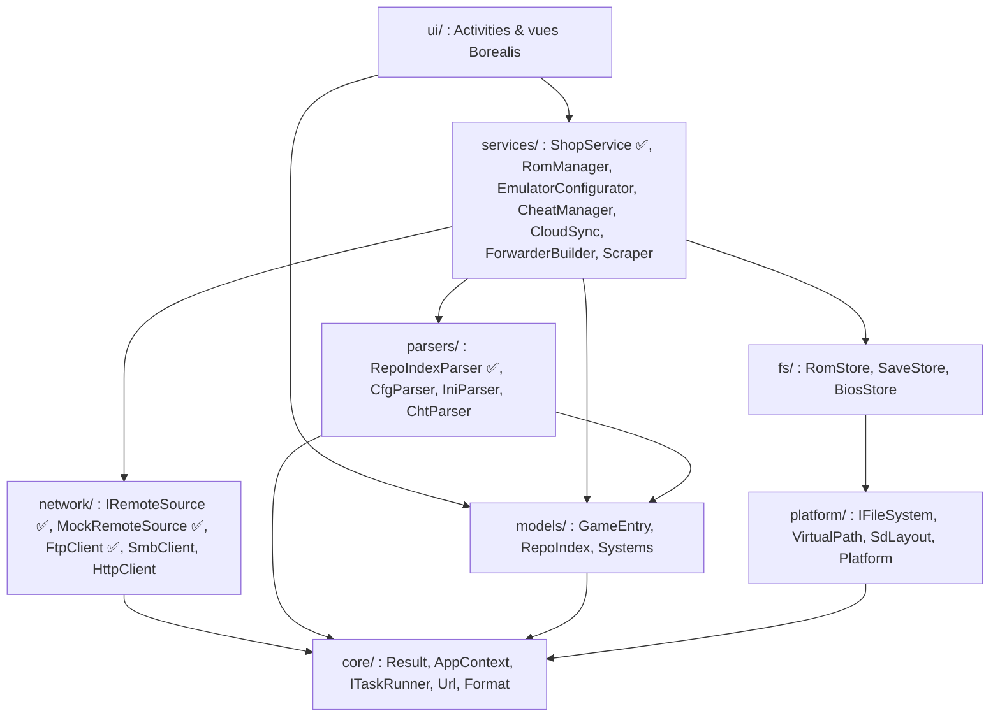
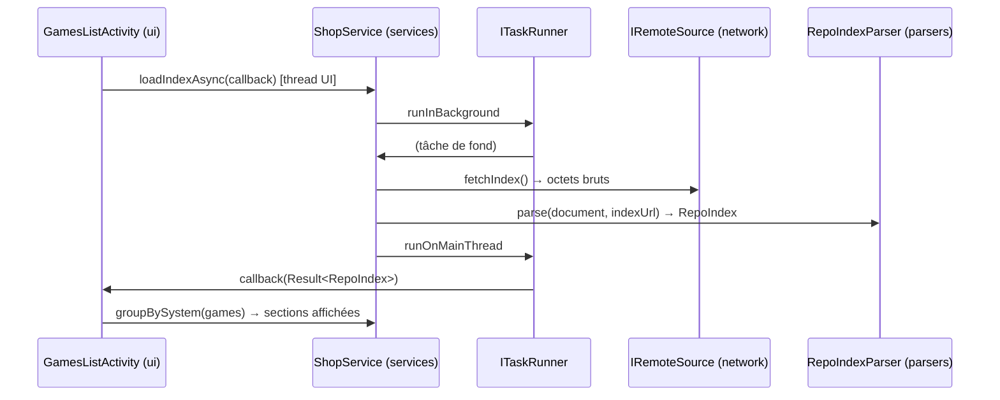
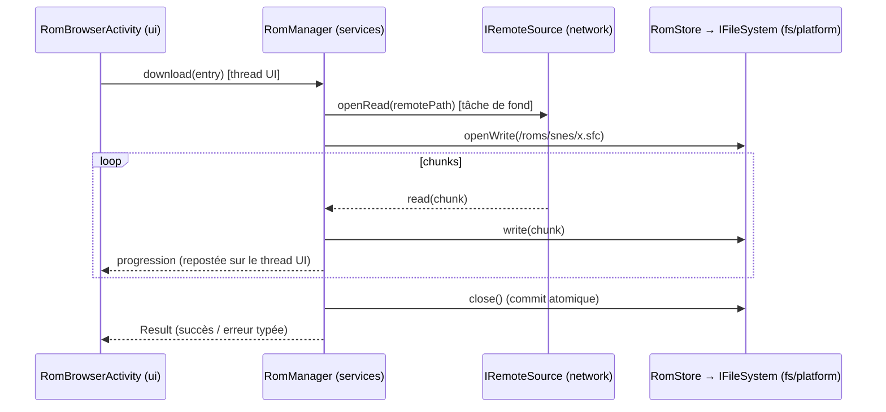

# Architecture de RetroManager

RetroManager est un homebrew Nintendo Switch (C++17, libnx, Borealis) qui gère
l'émulation rétro : sources réseau (FTP/SMB/JSON), ROMs, configuration de
RetroArch, cheats, sauvegardes cloud et forwarders.

Ce document fixe **comment le code est découpé et comment les modules
communiquent**. Toute contribution doit le respecter ; en cas de besoin qui le
contredit, on modifie d'abord ce document.

---

## 1. Principes

1. **Dépendances à sens unique.** Une couche ne connaît que les couches situées
   en dessous d'elle. Aucune dépendance ne remonte, aucun cycle n'existe.
2. **La plateforme est une abstraction.** Aucun module n'appelle directement
   `<filesystem>`, `fopen`, libnx ou libcurl : il passe par une interface
   (`IFileSystem`, puis `IRemoteSource`, `ISystem`…).
3. **Injection explicite.** Chaque classe reçoit ses dépendances par son
   constructeur. Aucun singleton ni état global dans le code métier.
4. **Tout le code métier tourne sur PC.** C'est ce qui rend le TDD possible :
   la cible `retromanager_core` ne dépend ni de Borealis ni de libnx.
5. **Pas d'exceptions dans le core.** Les erreurs remontent par `Result<T>` et
   `Status` (`include/retromanager/core/Result.hpp`).

---

## 2. Couches



| Couche | Rôle | Peut dépendre de | Ne doit **jamais** |
|---|---|---|---|
| `core/` | Types de base (`Result`, `Status`), composition (`AppContext`), `ITaskRunner`, utilitaires purs (`Url`, `Format`) | STL | inclure Borealis ou libnx |
| `models/` | Données pures partagées par toutes les couches (`GameEntry`, `RepoIndex`, `SystemSection`) et catalogue des systèmes | `core` | contenir du comportement autre que des accesseurs |
| `platform/` | Abstractions système + implémentations par plateforme | `core` | contenir de la logique métier |
| `parsers/` | Fonctions **pures** texte ⇄ structures (`.cfg`, `.ini`, JSON, `.cht`) | `core`, nlohmann/json | faire des E/S : ils reçoivent et rendent des chaînes |
| `fs/` | Opérations SD typées (ranger une ROM, retrouver une save…) | `platform`, `core` | parler au réseau |
| `network/` | Déplace des octets derrière `IRemoteSource` | `core` (+ libcurl pour `FtpClient`) | parser un index, écrire sur la SD (il fournira des flux) |
| `services/` | Cas d'usage : orchestrent parsers, fs et network | tout ce qui précède | inclure Borealis |
| `ui/` | Affichage et navigation Borealis | `services`, `models`, `core` | appeler un parser, un `IRemoteSource` ou `IFileSystem` directement |

> Exception assumée : `HomeActivity` lit encore `AppContext` directement (plateforme,
> détection de RetroArch). Elle passera par un service système quand celui-ci
> existera (Phase configurateur).

### Cibles CMake

| Cible | Contenu | Plateformes |
|---|---|---|
| `retromanager_core` | `src/core`, `src/models`, `src/parsers`, `src/services`, `src/platform/common`, `MockRemoteSource` | toutes : c'est ce qu'on teste |
| `retromanager_curl` | `FtpClient` (libcurl). Option `RM_WITH_CURL`, activée par défaut | toutes |
| `RetroManager` | `src/main.cpp`, `src/ui`, **une seule** implémentation de `src/platform/{switch,desktop}` + Borealis | desktop, Switch (`.nro`) |
| `retromanager_mocks` | `tests/mocks` : `MemoryFileSystem`, chargeur de fausse SD | desktop (tests) |
| `retromanager_tests` | `tests/unit`, `tests/integration` (GoogleTest) | desktop |

La séparation physique des cibles fait respecter la règle : le core n'a pas
Borealis dans ses chemins d'inclusion, donc une violation ne compile pas.

---

## 3. Abstraction du système de fichiers

### 3.1 Chemins virtuels

L'application ne manipule qu'un seul format de chemin : **POSIX, absolu,
enraciné à la carte SD** (`/retroarch/retroarch.cfg`). `vpath::normalize()`
résout `.`, `..`, `//` et `\`, et **refuse** tout chemin relatif ou qui sort de
la racine (`/../x`). Seule l'implémentation d'`IFileSystem` sait convertir un
chemin virtuel en chemin réel.

`SdLayout` centralise les emplacements connus (RetroArch, sys-clk, dossier de
l'app). Ce sont des **valeurs par défaut** : dès la Phase 2, les services
liront les vrais chemins dans `retroarch.cfg`.

### 3.2 Contrat `IFileSystem`

- `stat`, `listDirectory` (trié par nom), `createDirectories` (idempotent),
  `openRead` / `openWrite` (par flux, pour les gros fichiers), `remove`,
  `removeAll`, `rename`, et des utilitaires communs (`readFile`, `writeFile`,
  `exists`…).
- **Écritures atomiques** : `openWrite` écrit dans un fichier de transit
  (`*.rm-partial`, masqué dans les listings), qui ne remplace la cible qu'au
  `close()`. Un crash ou une coupure réseau pendant un téléchargement ou une
  synchronisation ne laisse jamais de ROM tronquée ni de save corrompue.
- Codes d'erreur normalisés (`NotFound`, `NotADirectory`, `IsADirectory`,
  `NotEmpty`, `InvalidPath`, `PermissionDenied`…), identiques sur toutes les
  implémentations.

### 3.3 Implémentations

| Implémentation | Racine | Usage |
|---|---|---|
| `LocalFileSystem("sdmc:/")` | carte SD montée par libnx | console |
| `LocalFileSystem(<dossier>)` | `retromanager/sdmc/` ou `$RETROMANAGER_SD_ROOT` | app desktop sur une fausse SD |
| `test::MemoryFileSystem` | RAM | tests unitaires rapides et hermétiques, mode lecture seule simulé |

**Test de contrat** (`tests/unit/FileSystemContractTest.cpp`) : la même suite
s'exécute contre chaque implémentation. C'est la garantie qu'un service validé
sur le mock en mémoire se comporte pareil sur la vraie SD.

### 3.4 Fausse carte SD

`tests/fixtures/sd_card/` est la **seule source de vérité** de la fausse SD :

- les tests la chargent en mémoire (`test::makeMockSdCard()`, une copie
  indépendante par appel) ;
- `tools/make_mock_sd.py` la copie dans `retromanager/sdmc/` pour lancer l'app
  desktop sans jamais modifier la fixture.

---

## 4. Communication entre modules

### 4.1 Composition

`main.cpp` est la **racine de composition**, le seul endroit qui sait sur
quelle plateforme on tourne :

```
createPlatformServices()  →  AppContext(fs, layout, …)  →  services(ctx…)  →  Activities(services…)
```

Les services reçoivent des références aux interfaces dont ils ont besoin. Un
test construit exactement le même graphe autour d'un `MemoryFileSystem` et
d'un faux `IRemoteSource`.

### 4.2 Flux implémenté (Phase 2) : afficher la boutique



L'UI ne connaît que `ShopService` et les modèles. `main.cpp` choisit la
source (aujourd'hui `MockRemoteSource`, demain `FtpClient` selon
`config.json`) : changer de source ne touche ni l'UI ni le service.

Format de l'index : [docs/INDEX_FORMAT.md](docs/INDEX_FORMAT.md).

### 4.3 Exemple de flux (Phase 3) : télécharger une ROM



### 4.4 Asynchronisme

- Les opérations longues (réseau, copie, scraping) passent par `ITaskRunner`
  (`core/ITaskRunner.hpp`) : `ui::BorealisTaskRunner` (`brls::async` /
  `brls::sync`) dans l'app, `ImmediateTaskRunner` ou une file manuelle dans
  les tests, qui restent donc synchrones et déterministes.
- Les services livrent leurs résultats par callback **sur le thread
  principal**. Ils ignorent tout de Borealis : c'est l'implémentation
  d'`ITaskRunner` fournie par l'UI qui fait le saut de thread.
- Une activité fermée avant la fin d'un chargement ne doit pas être touchée
  par le callback : `GamesListActivity` garde un drapeau de vie
  (`shared_ptr<bool>`), vérifié sur le thread principal.
- `Application::exit()` de Borealis attend la fin du thread de tâches : les
  services créés dans `main()` survivent donc à toute tâche en cours.
- Pas de bus d'événements global tant qu'un besoin réel n'apparaît pas
  (synchronisation cloud en arrière-plan, par exemple).

### 4.5 Gestion des erreurs

`Result<T>` / `Status` à chaque frontière. Les services ajoutent du contexte au
message ; l'UI traduit `ErrorCode` en message localisé (i18n : réseau,
authentification, index introuvable, format invalide). Aucune exception ne
traverse une frontière de couche (le parser attrape celles de nlohmann/json).

---

## 5. Stratégie de test (TDD)

1. **Test d'abord** pour toute fonction critique (parsers, écriture de
   `.cfg`, synchronisation, parsing des listings FTP).
2. **Unitaires** (`tests/unit`) : `MemoryFileSystem` et fakes, rapides.
3. **Contrat** : une suite par interface, exécutée sur chaque implémentation.
4. **Intégration** (`tests/integration`) : `FtpClient` contre un vrai serveur
   FTP local (`tools/test_ftp_server.py`, pyftpdlib) servant
   `tests/fixtures/ftp_root`. Ces tests sont ignorés (`SKIPPED`) si
   `RM_TEST_FTP_PORT` n'est pas défini.
5. **CI** (`.github/workflows/retromanager.yml`) : tests sous ASan et UBSan,
   build desktop, build Switch `.nro` dans le conteneur `devkitpro/devkita64`.

---

## 6. Organisation des fichiers

```
retromanager/
├── CMakeLists.txt, CMakePresets.json   # presets tests / desktop / switch
├── cmake/                              # FetchBorealis (avant project()), Dependencies, Curl
├── docs/                               # INDEX_FORMAT.md, captures
├── include/retromanager/<couche>/      # en-têtes publics, un dossier par couche
├── src/<couche>/                       # implémentations (même découpage)
│   └── platform/{common,switch,desktop}
├── resources/                          # XML Borealis, i18n (en-US, fr), images
├── tests/{mocks,unit,integration,fixtures/{sd_card,ftp_root}}
└── tools/{make_mock_sd.py,test_ftp_server.py}
```

Nommage : `IXxx` pour une interface, un fichier par classe, espace de noms
`rm` (`rm::ui`, `rm::test`, `rm::vpath`).

---

## 7. Feuille de route

| Phase | Contenu | Statut |
|---|---|---|
| 0–1 | Squelette, `IFileSystem` avec mocks, fausse SD, écran d'accueil, CI | ✅ |
| 2 | Boutique : `GameEntry`, `RepoIndexParser`, `IRemoteSource` (mock + FTP), `ShopService`, liste Borealis | ✅ |
| 3 | Téléchargement : `IRemoteSource::openRead` en flux, `RomStore`, écriture atomique sur la SD, progression | — |
| 4+ | Configuration des sources (`config.json`), SMB/HTTP, scraping, configurateur RetroArch, cheats, cloud saves, forwarders | — |
