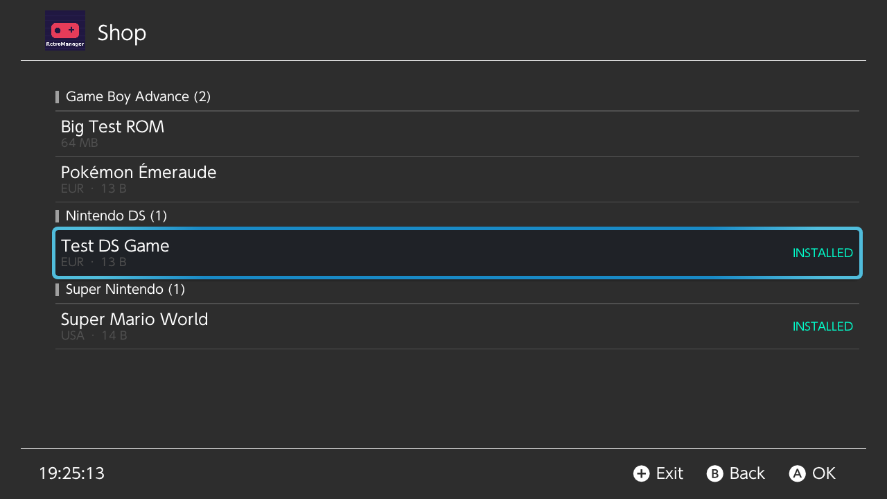
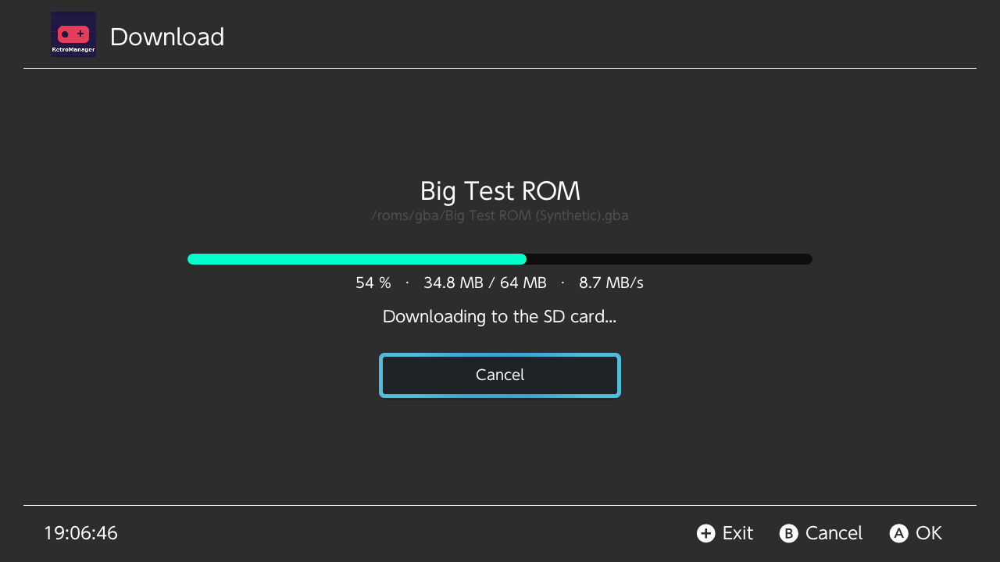
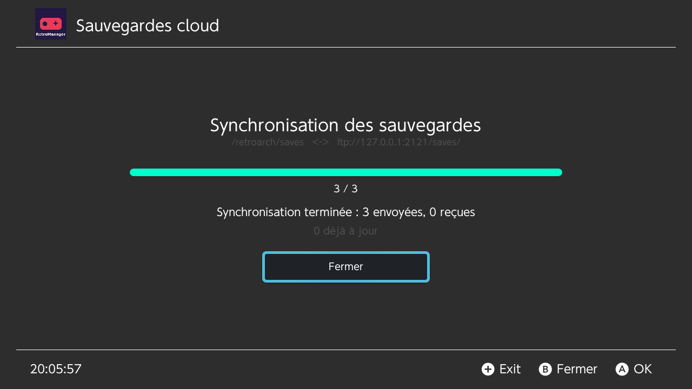
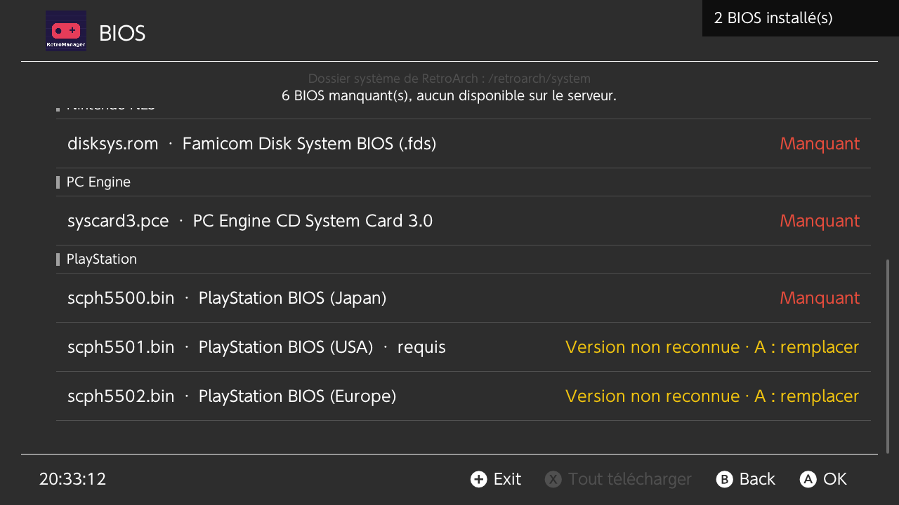
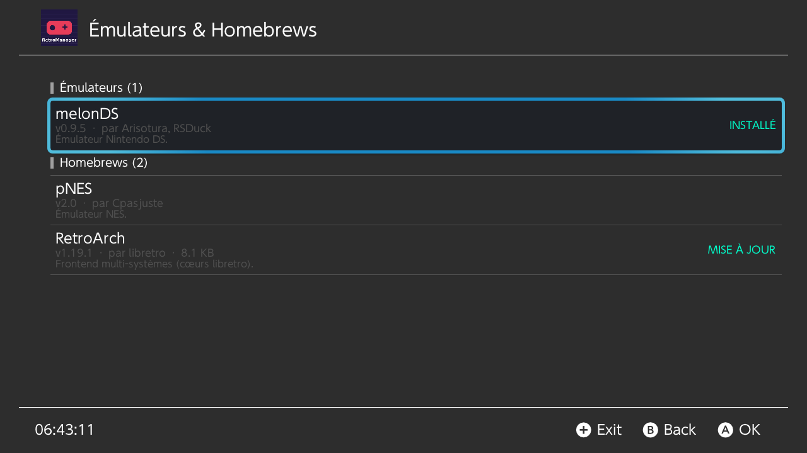
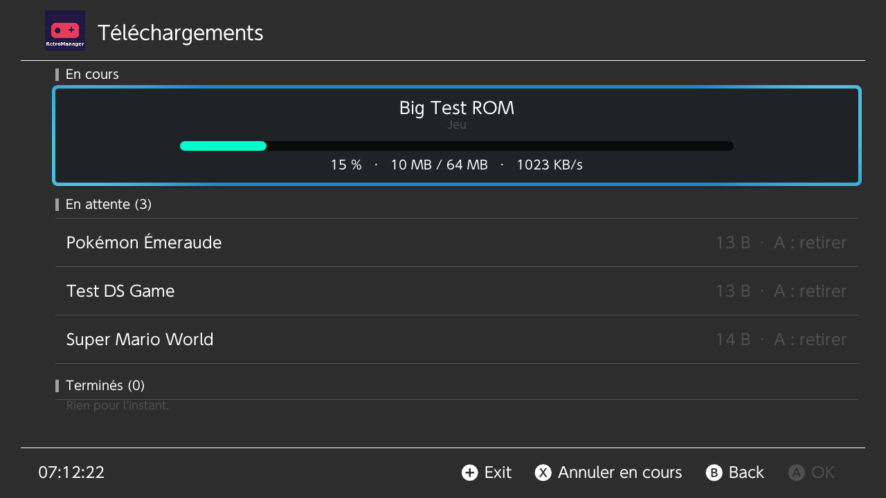
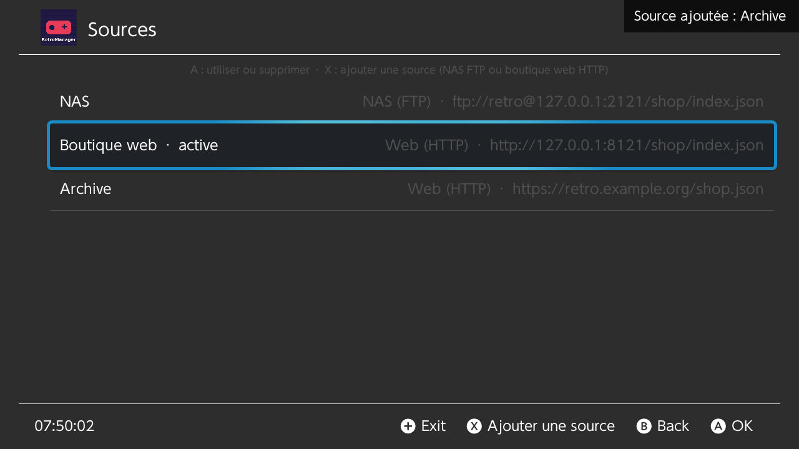
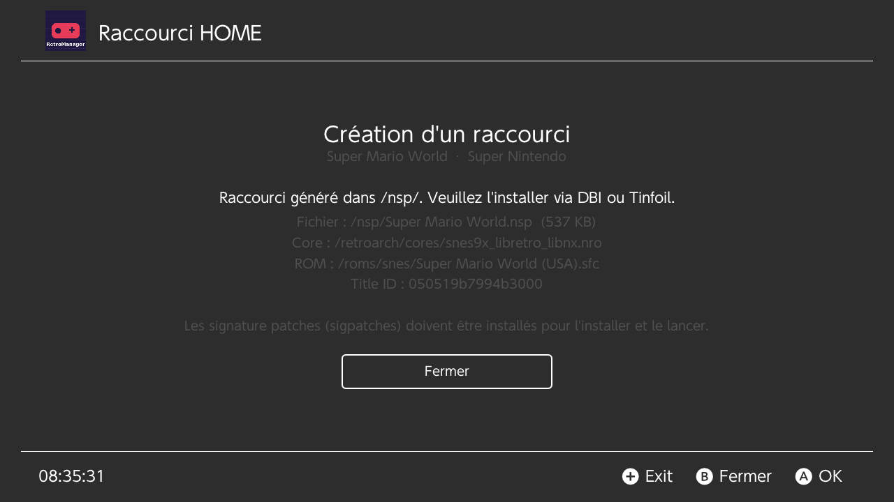

# RetroManager

Gestionnaire d'émulation rétro pour Nintendo Switch, « un Tinfoil pour le
rétro ». C++17, libnx, [Borealis](https://github.com/xfangfang/borealis).










Après chaque téléchargement, RetroManager intègre le jeu à RetroArch : il
l'ajoute à la playlist de son système (il apparaît directement dans le menu
principal), installe sa jaquette et ses codes de triche si la boutique en
fournit, et règle le navigateur de fichiers sur son dossier (éditions qui
préservent le reste des fichiers). Pour les jeux N64 / PlayStation, il règle
aussi sys-clk (CPU à 1785 MHz pour RetroArch).

L'écran « Émulateurs & Homebrews » est un App Store personnel : il installe
les `.nro` de votre NAS (RetroArch, melonDS, pNES…) dans
`/switch/<nom>/<nom>.nro`, avec leur icône, et signale les mises à jour.

Les boutiques peuvent être un partage SMB (Windows, ZimaOS, Synology… en
SMB2/3, sans rien installer sur le NAS), un NAS en FTP/FTPS ou un site web
(HTTP/HTTPS),
plusieurs à la fois (écran « Sources ») ; sans jaquette dans l'index,
RetroManager va la chercher sur le serveur de vignettes libretro.

Tous les téléchargements passent par une file (conservée entre deux
lancements, elle reprend toute seule) : un clic ajoute le jeu ou
l'application, la file les traite un par un en arrière-plan (écran
« Téléchargements » : progression, retrait, annulation), et un
téléchargement coupé reprend là où il s'était arrêté (FTP `REST`).

L'écran « Vérification des BIOS » liste les BIOS attendus par les cœurs
(GBA, PlayStation, DS…), vérifie leur MD5 et télécharge ceux qui manquent
depuis la boutique.

Le bouton « Synchroniser les sauvegardes » échange les `.srm` / `.sav` de
RetroArch avec un dossier du NAS (`saves_url`), dans les deux sens, sans
jamais perdre une version en cas de conflit.

Sur un jeu installé, X « Créer un raccourci (Forwarder) » génère
`/nsp/<titre>.nsp` : une icône sur l'accueil de la console qui lance
directement le jeu dans RetroArch (jaquette en icône, core choisi selon le
système). Il faut vos `prod.keys` et un stub de forwarder sur la carte, puis
l'installer avec DBI ou Tinfoil (sigpatches requis) : voir
[docs/FORWARDERS.md](docs/FORWARDERS.md).

L'organisation du code est décrite dans [ARCHITECTURE.md](ARCHITECTURE.md).

## Prérequis

- CMake ≥ 3.22, Ninja, un compilateur C++17 (GCC ≥ 9, Clang ≥ 10).
- Build desktop : en-têtes OpenGL et X11/Wayland. Sous Debian/Ubuntu :
  `sudo apt install libgl-dev libxrandr-dev libxinerama-dev libxcursor-dev libxi-dev libxkbcommon-dev libwayland-dev libdbus-1-dev pkg-config`
- libcurl (client FTP) : `sudo apt install libcurl4-openssl-dev` conseillé. À
  défaut, CMake compile une libcurl minimale (FTP/HTTP, TLS via OpenSSL si
  présent). `-DRM_WITH_CURL=OFF` désactive le client FTP.
- Build Switch : [devkitPro](https://devkitpro.org/wiki/Getting_Started) avec
  `switch-dev switch-glfw switch-mesa switch-glm switch-curl`, et `DEVKITPRO` défini (ou
  le conteneur Docker `devkitpro/devkita64`).

Borealis, GoogleTest et nlohmann/json (et libcurl si besoin) sont récupérés automatiquement par
CMake (FetchContent, versions épinglées).

## Commandes

Toutes les commandes se lancent depuis `retromanager/`.

```sh
# Tests unitaires seuls : rapide, sans Borealis ni dépendances GPU
cmake --preset tests && cmake --build --preset tests && ctest --preset tests

# App desktop + tests, sur une fausse carte SD dont config.json pointe vers
# ftp://127.0.0.1:2121 et http://127.0.0.1:8121 (serveurs de test, limités à 8 Mo/s
# pour voir la progression ; boutique dans /shop, sauvegardes cloud dans /saves,
# faux serveur de vignettes libretro dans /thumbnails)
python3 tools/make_mock_sd.py          # crée ./sdmc à partir de tests/fixtures/sd_card
python3 tools/test_ftp_server.py --port 2121 --http-port 8121 --throttle-kbps 8192 &
cmake --preset desktop && cmake --build --preset desktop
./build/desktop/RetroManager           # -d : logs debug, -v : vue de debug

# Sur desktop : Entrée = A, Échap = B, clic milieu = X (pas de Y au clavier : passez par l'accueil)
# Interface en français (sur Switch : langue de la console)
RETROMANAGER_LANG=fr ./build/desktop/RetroManager

# Autre fausse SD
RETROMANAGER_SD_ROOT=/chemin/vers/sd ./build/desktop/RetroManager

# Boutique de démonstration sans réseau : "type": "mock" dans sdmc/switch/RetroManager/config.json
# Écrans de chargement et d'erreur de la boutique (source mock)
RETROMANAGER_MOCK_LATENCY_MS=3000 ./build/desktop/RetroManager
RETROMANAGER_MOCK_ERROR=network ./build/desktop/RetroManager   # network|auth|notfound|format
RETROMANAGER_MOCK_SPEED_KBPS=2048 ./build/desktop/RetroManager  # vitesse des téléchargements

# Tests d'intégration FTP + FTPS + HTTP contre de vrais serveurs locaux
# (pip install pyftpdlib pyopenssl ; openssl en ligne de commande)
python3 tools/test_ftp_server.py --port-file /tmp/ftp.port --ftps-port-file /tmp/ftps.port \
    --http-port-file /tmp/http.port &
RM_TEST_FTP_PORT=$(cat /tmp/ftp.port) RM_TEST_FTPS_PORT=$(cat /tmp/ftps.port) \
    RM_TEST_HTTP_PORT=$(cat /tmp/http.port) ctest --preset tests
# + SMB contre un vrai Samba (réglages par défaut : SMB2 minimum, comme un NAS)
sudo tools/test_smb_server.sh 4450 /tmp/rm-smb && RM_TEST_SMB_PORT=4450 ctest --preset tests -R Smb
# + contre-vérification des NSP générés par hactool (clés factices)
RM_HACTOOL=/chemin/vers/hactool ctest --preset tests -R ApplicationNsp

# Switch
cmake --preset switch && cmake --build --preset switch
# → build/switch/RetroManager.nro, à copier dans sdmc:/switch/
```

La source de la boutique se règle dans `sdmc:/switch/RetroManager/config.json`
([docs/CONFIG.md](docs/CONFIG.md)) ; le format des index est décrit dans
[docs/INDEX_FORMAT.md](docs/INDEX_FORMAT.md). Les ROMs sont installées dans
`/roms/<système>/`.

Sur desktop, `sdmc/` joue le rôle de la racine `sdmc:/` de la console : l'app
y lit et y écrit exactement comme elle le ferait sur la carte SD.

## Licences tierces

libsmb2 (client SMB2/3) est sous LGPL-2.1 : elle est compilée depuis ses
sources publiques (https://github.com/sahlberg/libsmb2, commit figé dans
`cmake/Dependencies.cmake`) et liée statiquement ; les sources de RetroManager
étant publiques, l'application peut être reconstruite avec une autre version
de la bibliothèque. stb (domaine public / MIT), nlohmann/json (MIT), libcurl
(licence curl), Borealis (Apache-2.0).
