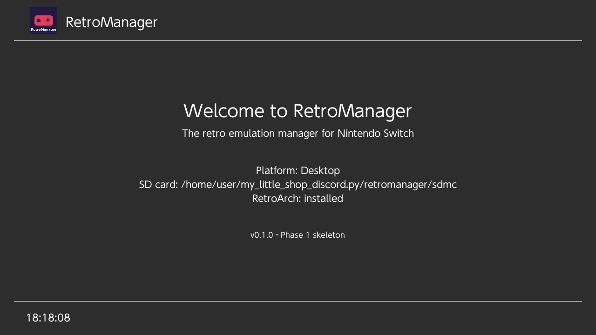

# RetroManager

Gestionnaire d'émulation rétro pour Nintendo Switch, « un Tinfoil pour le
rétro ». C++17, libnx, [Borealis](https://github.com/xfangfang/borealis).



L'organisation du code est décrite dans [ARCHITECTURE.md](ARCHITECTURE.md).

## Prérequis

- CMake ≥ 3.22, Ninja, un compilateur C++17 (GCC ≥ 9, Clang ≥ 10).
- Build desktop : en-têtes OpenGL et X11/Wayland. Sous Debian/Ubuntu :
  `sudo apt install libgl-dev libxrandr-dev libxinerama-dev libxcursor-dev libxi-dev libxkbcommon-dev libwayland-dev libdbus-1-dev pkg-config`
- Build Switch : [devkitPro](https://devkitpro.org/wiki/Getting_Started) avec
  `switch-dev switch-glfw switch-mesa switch-glm`, et `DEVKITPRO` défini (ou
  le conteneur Docker `devkitpro/devkita64`).

Borealis, GoogleTest et nlohmann/json sont récupérés automatiquement par
CMake (FetchContent, versions épinglées).

## Commandes

Toutes les commandes se lancent depuis `retromanager/`.

```sh
# Tests unitaires seuls : rapide, sans Borealis ni dépendances GPU
cmake --preset tests && cmake --build --preset tests && ctest --preset tests

# App desktop + tests, sur une fausse carte SD
python3 tools/make_mock_sd.py          # crée ./sdmc à partir de tests/fixtures/sd_card
cmake --preset desktop && cmake --build --preset desktop
./build/desktop/RetroManager           # -d : logs debug, -v : vue de debug

# Autre fausse SD
RETROMANAGER_SD_ROOT=/chemin/vers/sd ./build/desktop/RetroManager

# Switch
cmake --preset switch && cmake --build --preset switch
# → build/switch/RetroManager.nro, à copier dans sdmc:/switch/
```

Sur desktop, `sdmc/` joue le rôle de la racine `sdmc:/` de la console : l'app
y lit et y écrit exactement comme elle le ferait sur la carte SD.
