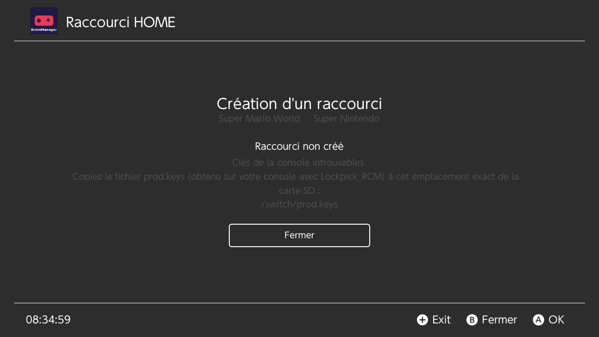

# Raccourcis HOME (forwarders)

Un *forwarder* est une petite application installée sur la console : son
icône apparaît sur l'écran d'accueil (HOME) et, une fois lancée, elle démarre
directement RetroArch avec le bon core et la bonne ROM.

## Créer un raccourci

1. Installez le jeu depuis la boutique (tag **INSTALLÉ**).
2. Dans la liste, sélectionnez-le et appuyez sur **X** : « Créer un raccourci
   (Forwarder) ».
3. Au bout de quelques secondes :
   *« Raccourci généré dans /nsp/. Veuillez l'installer via DBI ou Tinfoil. »*
4. Installez `/nsp/<titre>.nsp` avec DBI ou Tinfoil (installation depuis la
   carte SD). L'icône apparaît sur l'accueil.

Regénérer le raccourci d'un même jeu produit le même *title id* : la
nouvelle installation remplace l'ancienne.

Le *title id* a la forme d'une application standard, `0100xxxxxxxx0000`
(8 chiffres tirés du chemin de la ROM) : c'est ce que le menu HOME affiche.
Les raccourcis générés avant ce correctif (`05…`) ne s'affichaient pas :
désinstallez-les (DBI) et regénérez-les.

## Ce qu'il faut sur la carte SD

| Fichier | Rôle | Où le trouver |
|---|---|---|
| `/switch/prod.keys` | Clés de **votre** console (`header_key`, `key_area_key_application_00`), pour chiffrer les NCA | Dump avec Lockpick_RCM |
| `/switch/RetroManager/stub/main` | Exécutable du forwarder (ExeFS) | Un stub de forwarder type nx-hbloader qui lance `romfs:/nextNroPath` avec `romfs:/nextArgv` |
| `/switch/RetroManager/stub/main.npdm` | Métadonnées de l'exécutable (son title id est remplacé) | Livré avec le stub |
| `/switch/RetroManager/stub/logo/` *(facultatif)* | `NintendoLogo.png`, `StartupMovie.gif` affichés au lancement | Livrés avec certains stubs |
| `/retroarch/cores/<core>_libretro_libnx.nro` | Le core RetroArch du système | Mise à jour en ligne de RetroArch |

Un stub rangé en `stub/exefs/main` et `stub/exefs/main.npdm` est aussi
accepté. RetroManager ne fournit ni les clés ni le stub.

Si un fichier manque, l'écran le dit précisément, par exemple :

Les clés ne sont jamais recopiées, envoyées ni écrites dans les journaux.

## Ce que contient le NSP

- **Icône** : la jaquette du jeu installée pour RetroArch
  (`/retroarch/thumbnails/<système>/Named_Boxarts/<rom>.png`), mise à
  l'échelle sans être recadrée dans un carré 256x256 (bandes de la couleur du
  bord), en JPEG. Sans jaquette : une icône unie.
- **Titre** : le nom du jeu (toutes les langues) ; éditeur « RetroArch -
  <système> ».
- **Chaîne de l'icône** : le CNMT (type *Application*, `0x80`) référence la
  NCA *Control*, qui contient `control.nacp` et un `icon_<Langue>.dat` par
  langue (JPEG 256x256). Le NACP n'a pas de champ « type » : c'est le CNMT
  et le type de contenu des NCA qui font de l'ensemble une application.
- **Lancement** : `romfs:/nextNroPath` = le core, `romfs:/nextArgv` =
  `"sdmc:/retroarch/cores/<core>.nro" "sdmc:/roms/<système>/<rom>"`.
- **Core** : le premier installé parmi, par exemple, `mgba`, `vba_next`,
  `gpsp` (GBA), `snes9x`, `snes9x2010` (SNES), `mupen64plus_next` (N64),
  `genesis_plus_gx` (Sega), `pcsx_rearmed` (PlayStation), `desmume`,
  `melonds` (DS).

## Limites

- **Sigpatches obligatoires** : les NCA et le NPDM ne peuvent pas porter les
  signatures de Nintendo. Sans signature patches, l'installation ou le
  lancement est refusé.
- Le raccourci pointe vers les chemins de la carte : déplacer la ROM ou
  désinstaller le core le casse (regénérez-le).
- Génération de clés 0 : le NSP s'installe sur tous les firmwares.
